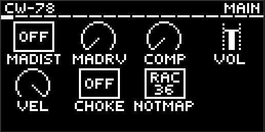
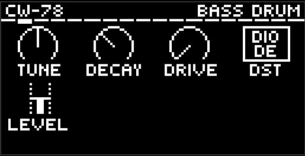
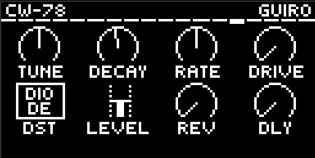
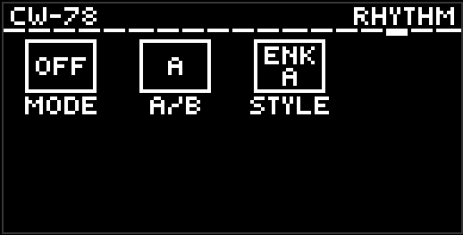
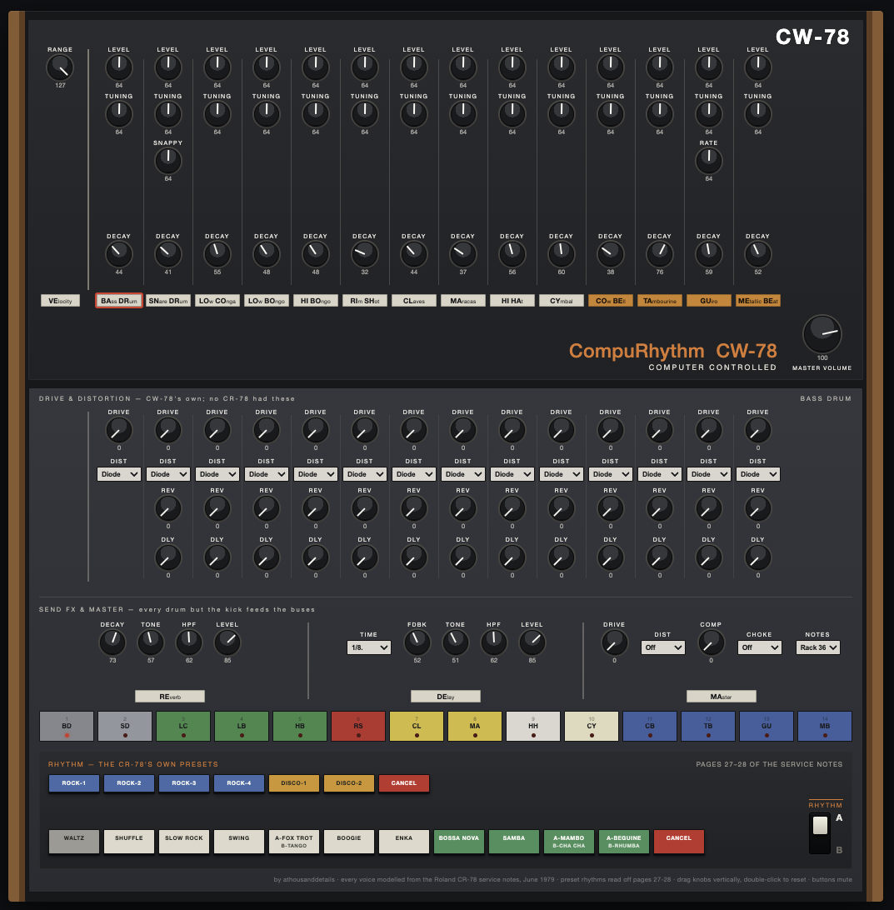

# CW-78 — CompuRhythm for Ableton Move

A Roland CR-78 for [Schwung](https://github.com/charlesvestal/schwung) on
Ableton Move. Fourteen voices, all synthesised, no samples — every one a model
of the CR-78's actual circuit, built from the 1979 service notes and held to
Roland's own factory alignment figures. The machine's twenty preset rhythms
ship with it, transcribed from the same document.






## What it is checked against

Page 30 of the service notes is Roland's factory alignment procedure: for
every voice, the frequency and decay time the machine is trimmed to. The
voices here are built from the schematics on pages 25–26; the table was
measured off hardware by the people who built it. The two were arrived at
independently, so agreement means something — and `./test/all.sh` will not
pass unless every lane lands on it.

The cleanest case: the rim shot is a 700 mH coil (part 022-033) across
16.5 nF, which computes to **1481 Hz** — and the factory table says **1480**.
Nothing was fitted to make that happen.

## Voices

| Voice | Engine |
|---|---|
| Bass Drum | A three-section RC **phase-shift ladder** inside a transistor's feedback loop — solving the real network for its 180° point lands on the factory 62.5 Hz with nothing fitted. **Decay is loop gain**, not an envelope: longer rings louder, as a regenerative circuit does. The ladder is a highpass network, so the strike's click leaks through to the output — most of what a kick is on a small speaker |
| Low / Hi Bongo, Low Conga | The same channel three more times with only the capacitors changed — 400, 600 and 208 Hz, ringing 40, 40 and 150 ms |
| Snare | The one voice that is two circuits at once: a 340 Hz shell of the same family, and the shared noise source through C514/R511's 27 ms envelope. **Snappy** moves the snap against the shell around the hardware's own fixed balance |
| Rim Shot | 700 mH and 16.5 nF, struck and left to ring. No transistor anywhere in it. 5 ms, and the loudest figure in the factory table |
| Claves | The same coil with a smaller capacitor — 2630 Hz, 18 ms |
| Hi-Hat / Cymbal / Maracas | One circuit, one envelope capacitor different each (C525 .018, C520 .12, C527 .0082). The cymbal adds the L3∥C521 tank — 9098 Hz, derived from the parts list |
| Cowbell | Two tones, VR67 at 800 Hz and VR68 at 555, through one band |
| Tambourine | Noise and a strike into the L5/C538 tank. L5's inductance is not in the parts list and is solved, not derived — measure a real one and exactly one number changes |
| Guiro | A cross-coupled **astable multivibrator** at the hardware's own 77–125 Hz. Those are not pitches — they are the **scrape rate**, the teeth — and each edge kicks a 6126 Hz tank. **Rate** walks between the two settings |
| Metallic Beat | Three RC relaxation oscillators on IC501 at 6170 / 5620 / 4080 Hz. **The bank free-runs** — the hardware has no way to reset it — so no two hits are quite alike |

There is **one noise source** for the whole machine — Q533, the transistor the
parts list calls out "for noise" — bussed to the hi-hat, cymbal, maracas,
tambourine and the snare's snap, so those lanes are **correlated** exactly as
the hardware has them. And all fourteen share one trigger front end: 0.027 µF,
270 k, a steering diode.

**Nothing was invented to fill the pad block.** A CR-78 has one hi-hat, two
bongos and one conga; the two spare pads are Main and the FX pages, not
made-up drums.

Every voice has **Tune, Decay, Drive, a Distortion type, Level** and — every
one except the kick — a pair of **send amounts (Rev, Dly)**. Every continuous
control is a **0–127 pot**, like the hardware — no Hz, no ms. The defaults are
page 30's figures, so a fresh patch is a correctly aligned CR-78.

**Seven distortion characters**, per voice and again on the master bus — the
same seven 9W9, 6W6 and 8W8 offer, so the knob means the same thing on all
four:

| | |
|---|---|
| **Diode** | back-to-back diode rounding |
| **Clip** | asymmetric soft clip, even harmonics and all |
| **SAT** | warm parallel saturation that keeps the transient |
| **BFZ** | thick fuzz wall |
| **PDIST** | biased cubic crunch |
| **Fold** | wavefolder, metallic without hollowing the note out |
| **Crush** | bit depth and sample rate falling together |

**Drive fully down is exactly dry** — the stage is not in the path at all, and
that is the default. The CR-78 had no drive stage, so a fresh patch has none.

## The preset rhythms

The CR-78's own patterns, transcribed from the notation on pages 27–28 of the
service notes, on the machine's own grid — the document states it outright:
48 steps to the measure, which is 12 to the beat, so sixteenths and triplets
both land exactly. That is why one clock plays a shuffle and a disco pattern.

Three controls on the **Rhythm** page:

| | |
|---|---|
| **Mode** | Off / Play. Off is the default. The rhythm plays **only while Move's transport runs** and stops with it |
| **A / B** | The RHYTHM lever, live on all seventeen buttons — which is where Roland's **"34 preset rhythms"** figure comes from: 17 × 2. On single-label caps it picks the style's A or B variation; on the three dual caps it picks which style plays |
| **Style** | Which **button** — seventeen, exactly the seventeen on the panel: Waltz, Shuffle, Slow Rock, Swing, A-Fox Trot/B-Tango, Boogie, Enka, Bossa Nova, Samba, A-Mambo/B-Cha Cha, A-Beguine/B-Rhumba, Rock 1–4, Disco 1–2 |

**Accent is a real channel**: the `(>)` marks in the score are per-step accent
pulses — on the hardware one control voltage into the BA662 VCA — and an
accented step plays at full velocity. The ADD VOICE lanes (tambourine, guiro,
metallic beat) appear in no preset, because they appear in none of the
notation: on the hardware they are mixed in by sliders, and playing one is
still up to you.

The transcriptions are a careful visual reading of a 1979 scan, not verified
against hardware; anything wrong is wrong by a note, not by a pattern, and
`tools/rhythm_check` renders all twenty to WAVs for checking by ear.

## Send FX

Two buses, fed post-fader from every voice by its **Rev** and **Dly** knobs
and returned before the master stages, so Master Drive/Distortion and the Comp
work on the wet signal too. Both are **silent at zero** — the kit is untouched
until you send it something, and the test suite holds that to the bit.

| | |
|---|---|
| **Reverb** | Four combs into two allpasses with the loop quantised to 12 bits, for the early-rack grain. Decay, Tone (loop damping), HPF, Level |
| **Delay** | Time is a **note division** and follows the host tempo: 1/32, 1/16T, 1/16, 1/8T, 1/16., 1/8, 1/4T, 1/8., 1/4, 1/2T, 1/4., 1/2, 1/2. The line is slewed, so changing tempo or division warps the echo like tape instead of clicking. Fdbk, Tone, HPF, Level |

The kick stays dry on purpose: reverb on a kick is mud, and the low end is
what each bus's input HPF exists to keep out of the wet path.

## Master

**Master Dist** and **Drive** across the kit, a one-knob **Comp** for glue
(hard bypass at zero, with AutoGain fitted so loudness stays flat as you turn
it up), **Volume**, **Velocity**, the **Choke** switch and the **Note Map**
switch. No always-on compressor or limiter anywhere else in the signal path.

**Velocity plays.** A hit at 127 is the loudest the kit gets; the Velocity
control is how far a soft hit falls below that, and it only ever carves
downwards. It reaches the voices the way the circuit would take it — as
trigger voltage into each lane's front-end diode, with the VCA carrying the
range below the voltage's floor — so a harder hit is a slightly different
sound and not only a louder one.

## Mods

Two things a CR-78 does not do, listed here and marked `MOD` at their site in
the source. Both default to the machine's behaviour, and `tools/golden_check`
holds a fresh patch bit-identical to the unmodified kit.

- **Decay range on Maracas and Tambourine.** The machine has one hi-hat, so
  those two are what you reach for as a second and a third — but their ranges
  were drawn tight around the factory decays. All three noise lanes now span
  the same ground (MA 5 ms–600 ms, TB 13 ms–1.5 s, HH untouched). The factory
  defaults moved by less than a third of one pot step.
- **A hat choke group** on Main — Off / MA-TB / All3. Off is the default and
  is inert. A 2 ms fade and an envelope dump, never a hard cut; a lane never
  chokes itself on a retrigger. The hardware chokes nothing — this is an
  addition, not a correction.

## Workflow on the Move

- **Pads (left 4×4)** play and select drums; the parameter page follows what
  you hit. Row 1: BD SD RS HH. Row 2: CY MA CL HB. Row 3: LB LC CB TB. Row 4:
  GU MB **Main** **FX**. **Shift+Pad** selects silently (works during
  playback). **Mute+Pad** mutes that drum (`[M]` in the title bar).
- **Pad 15** opens **Main**; **pad 16** alternates **Reverb / Delay**. These
  two only switch the page — they never sound.
- **Main-page lock:** press the **jog while on Main** to lock it (`[L]` in
  the title bar). Pads still play and record, but the page stops following
  them, so the master knobs stay under your hands while you jam. Shift+Pad
  still selects, and another jog click unlocks.
- **Knobs 1–8** edit the visible page, drawn with Schwung's stock knob grid
  (host 0.12.1+): **jog** cycles pages, **Shift+Jog** jumps sections, **jog
  click** opens the section list, **Shift** reveals values / fine mode,
  **Mute+knob** resets a pot to its factory default.
- **Sequencing:** use Move's own sequencer — a drum track with a kit, muted
  (HiJack), track MIDI OUT on the slot's channel. Each drum is its own lane.
  Note map: drum rack (36–49, default) or General MIDI, switchable.
- Works with [Movy](https://github.com/DimaDake/schwung-movy) — a
  `movy_config.json` ships with the module.

## Remote panel

A CR-78-style editor in the browser — walnut cheeks, black knobs with white
pointers, cream plates, and the machine's actual bottom panel: the seventeen
rhythm buttons in the hardware's own cap colours (cream ballroom, green latin,
blue rock, amber disco, red CANCEL) with the RHYTHM A/B lever beside them.
Every drum with draggable knobs, per-drum mutes synced with Mute+Pad on the
device, distortion selectors, the sends, both buses and Master. Open
`move.local:7700/remote-ui` while CW-78 is the slot's synth.



## Install

Requires Schwung **0.12.1 or newer**. Via the Schwung Module Store /
[schwung-manager](https://github.com/charlesvestal/schwung), or manually:
build, then copy `dist/cw78/` to
`/data/UserData/schwung/modules/sound_generators/cw78/` on the device.

## Building

Requires Docker (cross-compiles for the Move's ARM64, pinned to glibc 2.35):

```bash
./scripts/build.sh all            # builds build/dsp.so + dist/cw78-module.tar.gz
./scripts/deploy.sh move.local    # safe deploy (atomic rename, never over a live .so)
```

`scripts/build.sh` also builds `cr78_loadtest`, an on-device test that dlopens
the real `dsp.so` exactly as Schwung's chain host does: every pad sounds, the
two page pads stay silent, every generated key resolves, mutes, the choke, the
preset rhythms' transport gate, the send buses and state round-trip — end to
end.

The parameter surface has one source: `scripts/gen_params.py` generates the
pot table, `chain_params`, the page hierarchy and `movy_config.json` from a
single dict. Adding a control is one edit.

`./test/all.sh` runs everything that does not need the device:
**`voice_check`** (every lane against page 30's alignment table),
**`kit_check`** (the mix, anchored so a solo kick matches 8W8's level),
**`rhythm_check`** (the pattern bank against the Style buttons),
**`golden_check`** (the whole kit at defaults, held to the bit), the
sends-at-zero proof, the choke behaviour, a state round trip and a full
render. Steps whose tooling is missing report **SKIP** and say so, rather
than passing quietly.

## Credits and provenance

CW-78 stands on other people's work and says so:

- **The Roland CR-78 Service Notes** (June 20, 1979) — schematics, parts
  list, the factory alignment table and the preset rhythm notation. Every
  voice and every pattern here is built from this document; the analysis
  lives in [docs/CR78-CIRCUIT-ANALYSIS.md](docs/CR78-CIRCUIT-ANALYSIS.md),
  with what is derived, what is fitted and what is unknown kept separate.
- **[9W9](https://github.com/athousanddetails/schwung-9W9)**,
  **[6W6](https://github.com/athousanddetails/schwung-6W6)** and
  **[8W8](https://github.com/athousanddetails/schwung-8W8)** — the module
  shell: pad gestures, the Main-page lock, the seven distortion characters,
  the reverb/delay buses, the one-knob glue and the parameter generator, so
  all four kits feel identical under the hands. **No voice DSP is shared
  with any of them** — CW-78 contains no 808 or 909 circuitry.
- **[Schwung](https://github.com/charlesvestal/schwung)** by Charles Vestal
  and contributors — the platform and the shared `param_pages` knob grid;
  **[Movy](https://github.com/DimaDake/schwung-movy)** by DimaDake for the
  page model.

This project was developed with AI assistance (Claude), with human direction
and on-hardware verification throughout.

## Contributing

**Contributions are open to anyone, any time — just submit a PR.** Voice
tweaks, rhythm corrections, UI improvements, Movy templates, docs, bug
reports: all welcome. If you touch a voice, run `./test/all.sh` —
`voice_check` holds the kit to the machine and `golden_check` proves you did
not move it by accident. If you have a real CR-78 on a bench: **measure L5**
(the tambourine coil), and check the preset transcriptions by ear. Please
note in your PR which AI tools you used, if any (same policy as Schwung
upstream).

## License

GPL-3.0 — see [LICENSE](LICENSE) and [THIRD_PARTY.md](THIRD_PARTY.md).

## Disclaimer

Not affiliated with, approved or endorsed by Ableton or Roland. CR-78 and
CompuRhythm are trademarks of Roland Corporation, referenced only to describe
behaviour.
